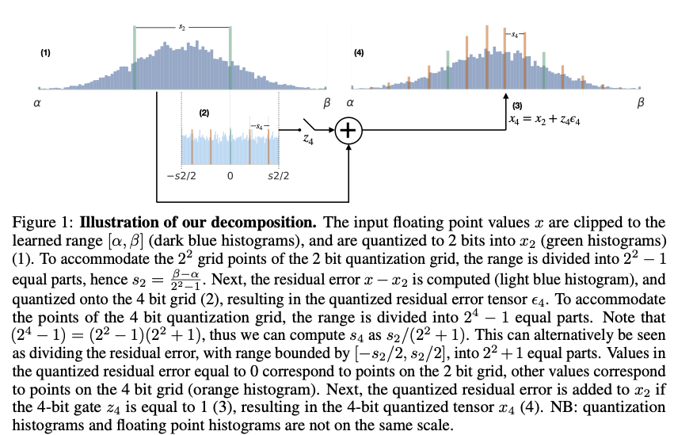

# Bayesian Bits
The code in this repo implements the Bayesian bits mixed precision quantization algorithm introduced in [Bayesian Bits: Unifying Quantization and Pruning](https://arxiv.org/abs/2005.07093) (van Baalen et al., NeurIPS2020). 
This repo can be used to reproduced the results presented in the paper, as described below.

## Reference
If you find our work useful for your research, please cite:

```
@inproceedings{baalen2020bayesianbits,
  title={Bayesian Bits: Unifying Quantization and Pruning},
  author={Baalen, Mart van and Louizos, Christos and Nagel, Markus and Amjad, Rana Ali and Wang, Ying and Blankevoort, Tijmen and Welling, Max},
  booktitle={Advances in Neural Information Processing Systems 33},
  year={2020}

}
```

## Abstract
We introduce Bayesian Bits, a practical method for joint mixed precision quantization and pruning through gradient based optimization. Bayesian Bits employs a novel decomposition of the quantization operation, which sequentially considers doubling the bit width. At each new bit width, the residual error between the full precision value and the previously rounded value is quantized. We then decide whether or not to add this quantized residual error for a higher effective bit width and lower quantization noise. By starting with a power-of-two bit width, this decomposition will always produce hardware-friendly configurations, and through an additional 0-bit option, serves as a unified view of pruning and quantization. Bayesian Bits then introduces learnable stochastic gates, which collectively control the bit width of the given tensor. As a result, we can obtain low bit solutions by performing approximate inference over the gates, with prior distributions that encourage most of them to be switched off. We experimentally validate our proposed method on several benchmark datasets and show that we can learn pruned, mixed precision networks that provide a better trade-off between accuracy and efficiency than their static bit width equivalents.

<div align="center">

</div>


# Running the code

To obtain the results reported in the paper, please use the following run commands. All commands are
assumed to be run from the included package's root directory.

The data is assumed to be stored in a directory `$DATA_DIR`. MNIST and CIFAR10 will be downloaded
to this directory. ImageNet should be present in a subdirectory named `imagenet_raw`. Please note
that due to the stochasticity inherent to our method results may vary between runs.

## Requirements
* Python: version 3.5
* PyTorch: version 1.1.0 
* NumPy: version 1.17.0
* TorchVision: version 0.3.0
* Click: version 6.7

### Environment variables
Please make sure the following environment variables are set:

```
export PYTHONPATH=$BAYESIAN_BITS_ROOT
export LC_ALL=C.UTF-8
export LANG=C.UTF-8
```


## MNIST
```
python benchmarks/image_net/gated_mixed_precision.py \
  --experiment=mnist --model lenet5quantized \
  --data-dir $DATA_DIR --method bayesian_bits \
  --gamma-4-init 6 --gamma-8-init 6 --gamma-16-init -6 --gamma-32-init -6 \
  --gating-method l0 \
  --learning-rate 1e-3 --learning-rate-q 1e-3 --learning-rate-s 1e-3 \
  --gating-lambda 1e-1 --batch-size 128 --eval-every 1 --epochs 100 \
  --learned-scale=range --include-pruning \
  --optimizer-q Adam --optimizer Adam --optimizer-s Adam \
  --reg-type bop`
```
This should give a result in the vicinity of 0.36% relative bops, 99.30% top 1 accuracy.

This should finish in approximately 45 minutes.

## CIFAR10
with `MU=0.01` or `MU=0.1`
```
python benchmarks/image_net/gated_mixed_precision.py \
  --experiment=cifar10 --model vggquantized \
  --data-dir $DATA_DIR --method bayesian_bits \
  --gamma-4-init 6 --gamma-8-init 6 --gamma-16-init 6 --gamma-32-init 6 \
  --gating-method l0 \
  --learning-rate 1e-3 --learning-rate-q 1e-3 --learning-rate-s 1e-3 \
  --gating-lambda $MU --batch-size 128 --eval-every 1 --epochs 300 \
  --learned-scale=range --include-pruning \
  --optimizer-q Adam --optimizer Adam --optimizer-s Adam \
  --reg-type bop
```

For `MU=0.01` this should give a result in the vicinity of 0.51% relative bops, 93.230% top 1 accuracy and 
for `MU=0.1` a result in the vicinity of 0.29% relative bops, 91.96% top 1 accuracy.

This takes approximately 18 hours to run.

## ImageNet

### ResNet18
We refer the reader to Table 4 for in the paper's Appendix for the results of full Bayesian Bits, after fine-tuning. 

Below is the main Bayesian Bits command. Run this with `MU` in 0.01, 0.03, 0.05, 0.07, 0.2 to reproduce
the main results from the paper:

```
python benchmarks/image_net/gated_mixed_precision.py \
  --experiment=imagenet --model=resnet18 \
  --data-dir=$DATA_DIR --method=bayesian_bits \
  --gating-method=l0 \
  --gamma-4-init=6 --gamma-8-init=6 --gamma-16-init=6 --gamma-32-init=-6 \
  --optimizer=SGD --optimizer-q=Adam --optimizer-s=Adam \
  --gating-lambda=$MU --batch-size=384 --eval-every=1 --epochs=30 \
  --learned-scale=range --pretrained --checkpointing --reg-type bop \
  --include-pruning \
  --learning-rate=3e-3 --learning-rate-s=1e-3 --learning-rate-q=1e-3 \
  --lr-schedule=multistep:10:20 --fixed-gate-finetune-epochs=10
```

NB: ImageNet experiments were run on a compute node with 4 Tesla V100 GPUs. 
A batch size of 384 might be too large to fit in GPU memory for smaller GPUs.

To reproduce the quantization only results, remove the `--include-pruning` flag and run with the same values of $MU.

To reproduce FP32 pruning-only results (not included in the paper due to too high resulting BOP count), add the `--prune-only` flag (and keep the `--include-pruning` flag). To get the fixed bit-width pruning-only results, add either the `--fixed-8bit` or `--fixed-48bit` for the w8a8 and w4a8 results, respectively. In both cases the `--prune-only` and `--include-pruning` flags should be present.
 
To reproduce the pre-fine-tuning results remove the `--fixed-gate-finetune-epochs=10` option.

By default, this repo produces 'Updated' Bayesian Bits results, i.e. without quantizers on activations feeding into residual connections.


These experiments may take several days to run. 
